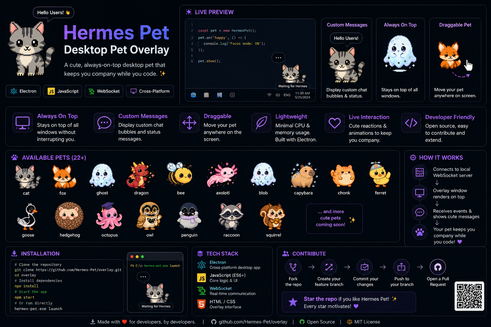
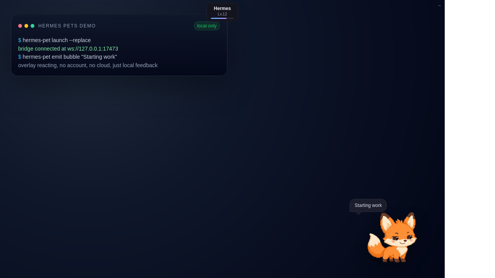
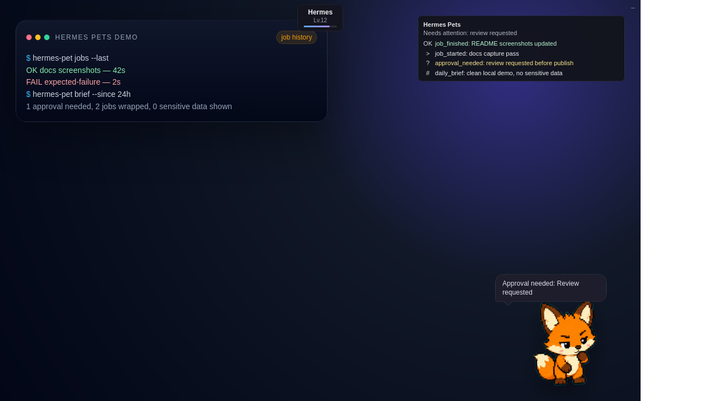
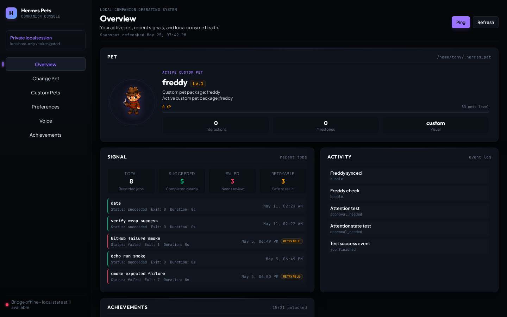
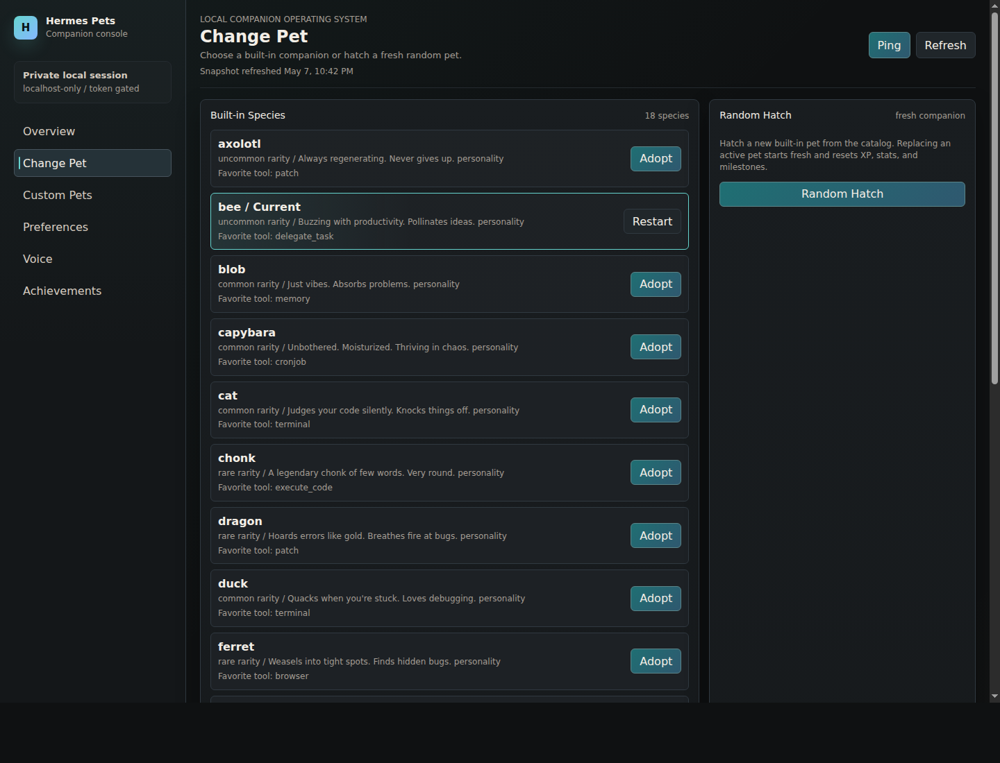
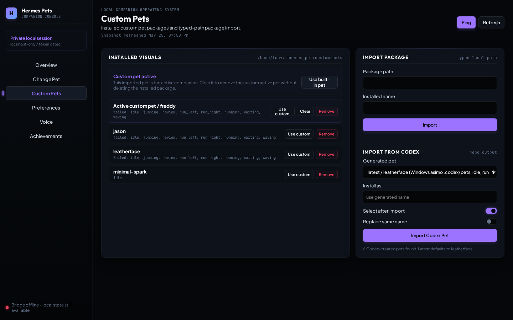
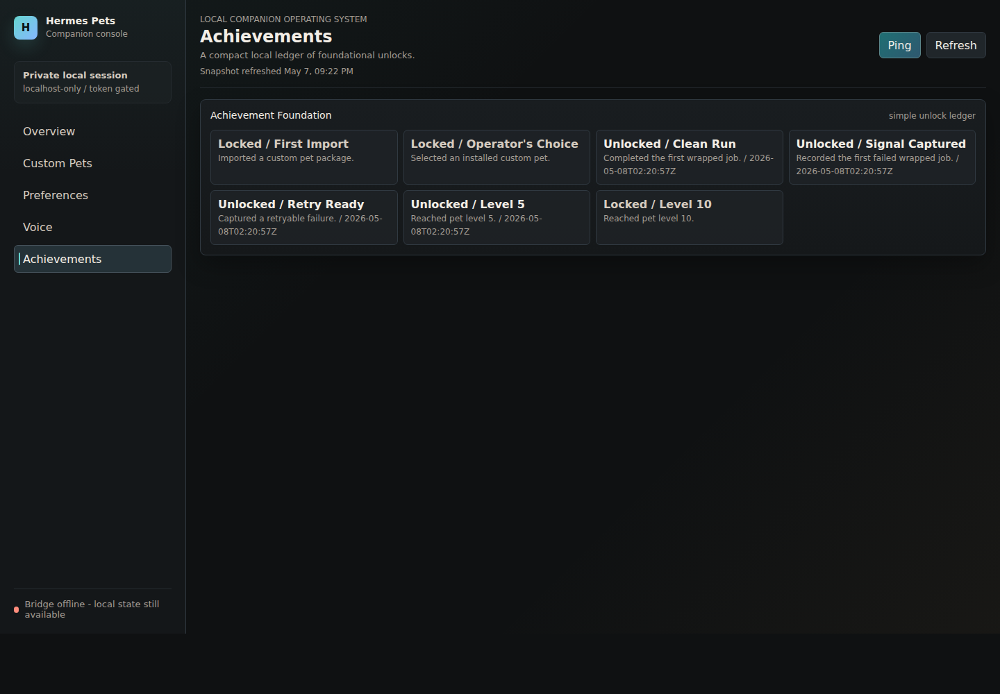

# Hermes Pets



Hermes Pets is a local desktop companion for Hermes-style daily work: a small animated overlay that reacts to commands, messages, briefs, and ambient status events while staying fully controllable from the terminal.

It exists to make long local coding sessions feel more legible and alive. The pet gives visible feedback when work starts, finishes, fails, needs attention, or goes quiet, without requiring a hosted service or remote account.

## What's New in 0.6.1

v0.6.1 ships the curated custom pet gallery with Freddy and Jason as repo-backed packages. The release also adds a gallery index and a release checklist so more custom pets can be added without inventing a new workflow.

- `docs/custom-pets/` now tracks the curated gallery entries.
- `docs/custom-pets/release-checklist.md` captures the add-a-new-pet workflow.
- Freddy and Jason ship as downloadable packages in the repo.

## Recap export

Use `hermes-pet recap export --since 24h` for a quick recap, or add `--output-dir` when you want to stash the bundle somewhere specific. `--since` accepts windows like `24h`, `7d`, or `30m`.

```bash
hermes-pet recap export --since 24h
hermes-pet recap export --since 7d --output-dir /tmp/hermes-pet-recaps
```

The repo combines a Python CLI, a WebSocket bridge, local state under `~/.hermes_pet`, and a floating Electron overlay for WSL/Windows. The current tool is focused on practical operator use:

- Launch one floating pet overlay from WSL/Windows.
- Emit lightweight activity events to the overlay.
- Wrap commands so successes, failures, duration, and retry information are recorded.
- Send message notifications from external channels.
- Control quiet/mute preferences for bubbles.
- Generate a short local brief from recent jobs and events.
- Open a localhost-only, token-protected dashboard for state, custom pets, prefs, voice preview, and achievements.
- Diagnose bridge, overlay, state, prefs, and job-history health.

Pet state and local history live under `~/.hermes_pet` by default. Set `HERMES_PET_HOME` when you intentionally want an isolated state directory. Back up the directory itself when you need a restorable copy; `hermes-pet state export` is a redacted diagnostic snapshot, not a backup format.

## In action

These screenshots are local demo captures. The text is generic, and there is no sensitive data in them.

| Launch bubble | Review tray | README banner |
| --- | --- | --- |
|  |  |  |
| The pet reacts to `hermes-pet launch` with a visible bubble and status card. | Job history and approval-needed state, with the event tray open. | The banner asset used at the top of this README. |

## Quickstart

Install from the repo, then launch the bridge and overlay:

```bash
# Install from GitHub
pip install 'git+https://github.com/asimons81/hermes-pets.git'

# Or, for local development
cd <repo>
pip install -e .

hermes-pet launch
hermes-pet emit bubble "Hello from Hermes Pets"
hermes-pet doctor
hermes-pet dashboard --no-open
```

On WSL/Windows, run the CLI from WSL. `hermes-pet launch` starts the Python bridge in WSL and opens the Electron overlay through the Windows PowerShell launcher.

## Platform Support

WSL2 on Windows 10/11 with Windows interop is the supported platform for the
full CLI, bridge, and floating Electron overlay experience. Native Linux,
macOS, and native Windows are investigation targets only in Phase 5; do not treat
CLI-only behavior on those platforms as full overlay support.

See `docs/platform-support.md` for the supported platform matrix, CLI-only
boundaries, and known blockers.

Packaging and installer tradeoffs are tracked in
`docs/packaging-decision-notes.md`. Phase 5 improves package readiness but does
not publish to PyPI.

## Install and CLI

For editable local development:

```bash
cd <repo>
pip install -e .
```

With `uv`:

```bash
uv tool install --editable <repo>
```

Non-editable installs are also supported:

```bash
cd <repo>
pip install .
```

Editable installs use the repo-local `overlay/` directory as source. On WSL/Windows, the PowerShell launcher mirrors that overlay into `%LOCALAPPDATA%\HermesAgent\pet-overlay-electron\app-<port>` before starting Electron, so the Windows process reads renderer files from a native Windows path instead of a flaky WSL UNC path. Non-editable installs use the packaged overlay assets and copy them to `~/.hermes_pet/cache/overlay` before the Windows launcher mirrors them into the same Electron cache.

The Python package exposes:

```bash
hermes-pet
hermes-pet-bridge
```

Running `hermes-pet` with no subcommand hatches a pet if one does not exist, or prints the current pet status.

Main commands:

```bash
hermes-pet launch
hermes-pet launch --replace
hermes-pet overlay-status
hermes-pet emit bubble "Starting work"
hermes-pet wrap --name "Tests" -- pytest
hermes-pet jobs --last
hermes-pet brief --since 24h
hermes-pet quiet
hermes-pet mute 30m
hermes-pet doctor
hermes-pet doctor --strict
```

Basic pet commands are also available:

```bash
hermes-pet status
hermes-pet hatch
hermes-pet rename "Hermes"
hermes-pet feed
hermes-pet pet
hermes-pet play
hermes-pet species
```

## Updating Hermes Pets

Use the guarded update command when you want Hermes Pets to inspect or update
itself without asking you to remember the git, Python packaging, and Electron
overlay steps by hand:

```bash
hermes-pet update --check
hermes-pet update --dry-run
hermes-pet update
hermes-pet update --yes
hermes-pet update --no-install
hermes-pet update --verbose
```

`hermes-pet update --check` gathers diagnostics, fetches git metadata for git
checkout installs, and reports whether the local branch is current, behind,
ahead, diverged, blocked by local changes, or missing an upstream. It does not
pull or install dependencies. A cleanly completed check exits successfully; read
the `Check result` and git status lines to distinguish current, update
available, and blocked states.

`hermes-pet update --dry-run` prints the planned fetch, comparison,
fast-forward-only update, dependency refresh, and validation steps without
mutating files. A normal `hermes-pet update` only updates git checkout installs
that have a clean working tree and a configured upstream branch. If an update is
available, interactive shells ask for confirmation; non-interactive shells must
pass `--yes` or `-y`.

Dirty working trees are blocked. The command will not merge, rebase, hard reset,
or auto-stash. Unknown install modes get diagnostics and manual guidance instead
of risky changes. Git checkout installs get the safest automatic path: fetch,
compare, fast-forward only, refresh dependencies when appropriate, then run
lightweight validation.

Dependency refreshes use the current Python executable and the overlay package
manager selected by lockfile: `pnpm-lock.yaml`, `yarn.lock`,
`package-lock.json`, then `npm install` when no lockfile is present.
`--no-install` skips both Python and Electron overlay dependency refresh and
prints the commands you can run manually.

`--verbose` adds extra install diagnostics, including recorded package source
metadata when Python packaging made it available. It still does not inspect or
write pet state.

Install diagnostics identify the Python executable, Python environment, package
location, editable status, recorded package source when available, git checkout
state, overlay dependency state, package manager availability, and Python
packaging files. Automatic git updates are only enabled when the running package
resolves to the repo source package, not merely because a virtual environment
lives somewhere inside a git checkout.

The update command never modifies `~/.hermes_pet`. It does not migrate, reset,
rewrite, delete, or back up pet state. If you need a backup, copy the real
`~/.hermes_pet` directory.

## Local Dashboard and Achievements

v0.3.0 adds a local dashboard:

```bash
hermes-pet dashboard
hermes-pet dashboard --no-open
hermes-pet dashboard --host 127.0.0.1 --port 17474
```

The dashboard binds to localhost only and prints a per-process token URL. Keep
that URL private. Requests without the token are rejected, including API calls.
The token is also stored in a local dashboard cookie so browser navigation can
continue to call the protected API without exposing an unauthenticated control
surface. This is not a hosted or remote dashboard.



The dashboard is the working console, not a marketing page. It shows the pet,
selected custom pet, notification prefs, recent jobs/events, bridge status,
voice preview controls, and foundational achievements. The overview centers the
active pet, keeps recent wrapped-job signal close by, and shows local bridge
health without implying hosted access.

The Change Pet view can switch to a specific built-in species or hatch a fresh
random pet. Both choices replace the canonical active pet in `pet.json`, matching
`hermes-pet hatch` reset semantics: XP, stats, interactions, milestones, variant,
hat, and timestamps start fresh. Changing the active built-in pet also clears the
current custom pet selection so the visible companion returns to the selected
built-in species, while installed custom pet packages stay on disk.



The Custom Pets view mirrors the CLI workflow for local custom pet packages:

- `Import` installs a package from a typed local path with an installed name.
- `Use` makes an installed custom pet the canonical active pet in `pet.json`.
- `Use built-in pet` clears the current custom pet selection without deleting
  installed packages; if the active pet was custom-only, it clears that active pet state.
- `Remove` deletes an installed custom pet package and clears it if it was
  selected.



Achievements are intentionally foundational in v0.3.0. Hermes Pets stores the
local ledger in `achievements.json`, unlocks achievements idempotently, and shows
compact locked/unlocked status in the dashboard. New unlocks can also emit quiet
overlay notices such as `Achievement unlocked: Clean Run`; they are informational
and do not add confetti, sound, modals, or celebration artwork.



The dashboard also supports changing notification profile, quiet mode, tray/idle
toggles, bubble throttle, opt-in voice preview, one harmless voice adapter test,
and dashboard test events when the overlay bridge is available.

v0.3.0 deliberately does not include a hosted dashboard, hosted gallery,
drag/drop import, full voice mode, rich celebration system, PyPI publishing, or
installer publishing.

## Custom Animated Pets

Hermes Pets can use custom animated sprite packages without adding generated assets to the repo. Custom pets install into the active state directory:

```text
${HERMES_PET_HOME:-~/.hermes_pet}/custom-pets/<pet-name>/
```

Manage them with:

```bash
hermes-pet custom-pet list
hermes-pet custom-pet validate <path>
hermes-pet custom-pet preview <path> --output /tmp/pet-preview.html
hermes-pet custom-pet preview --installed <name> --output /tmp/pet-preview.html
hermes-pet custom-pet import <path> --name <name>
hermes-pet custom-pet codex
hermes-pet custom-pet import-codex latest --use
hermes-pet custom-pet use <name>
hermes-pet custom-pet current
hermes-pet custom-pet remove <name>
```

The same import/activate/remove workflow is available in the local dashboard, with
one extra non-destructive control: clearing a custom pet keeps the installed
package on disk. Use the CLI for validation and preview HTML when preparing a
package, then use the dashboard when you want a compact operator surface for
activating, clearing, or removing installed custom pet packages.

`<path>` can be a finalized `hatch-pet` run or a package with `custom-pet.json` and `sprites/<state>/*.png`. `idle` is required; optional states fall back to idle when missing. See `CUSTOM_PETS.md` for the package format and the repo-local Codex skill at `.codex/skills/hermes-pet-hatch/SKILL.md`.

Codex-created pets have a shortcut path: `custom-pet codex` discovers valid Codex desktop pets in `CODEX_HOME/pets`, `~/.codex/pets`, and `/mnt/c/Users/*/.codex/pets`, then `custom-pet import-codex <slug|latest|path> --use` imports and activates one without copy-pasting long paths. The Codex custom-pet trust path hardens duplicate WSL/Windows candidates with source labels, lets explicit dashboard choices submit direct paths, and reports bridge-offline state honestly after selection. Pass `--include-repo-output` only when you intentionally want to scan old repo-local `output/hermes-pet-hatch/` or `output/hatch-pet-runs/` candidates.

The curated gallery entries that ship with the repo live under `docs/custom-pets/`. Freddy and Jason are the first downloadable packages there, and `docs/custom-pets/release-checklist.md` captures the add-a-new-pet workflow so future custom pets stay consistent.

For a safe preview workflow, validate or package the pet, inspect the generated contact sheet when present, then run `hermes-pet custom-pet preview <path> --output /tmp/pet-preview.html`. To prove the bridge and renderer can load the package, import and activate it inside a temporary `HERMES_PET_HOME` and run `scripts/verify-live-overlay.sh` or launch with `hermes-pet launch --replace`.

## Launch

Start the bridge and launch the overlay:

```bash
hermes-pet launch
```

On WSL/Windows, `launch` uses `overlay/scripts/launch-windows-overlay.ps1`. That launcher keeps the Electron install and mirrored overlay app under `%LOCALAPPDATA%\HermesAgent\pet-overlay-electron`, reuses an existing overlay when one is already running, and points it at `ws://127.0.0.1:17473` by default.

The launch boundary is:

```text
WSL shell
  -> hermes-pet launch
  -> Python bridge in WSL on ws://127.0.0.1:17473
  -> Windows PowerShell launcher
  -> Electron dependency cache in %LOCALAPPDATA%\HermesAgent\pet-overlay-electron
  -> mirrored overlay app in %LOCALAPPDATA%\HermesAgent\pet-overlay-electron\app-17473
  -> floating Windows overlay
```

Keep `pwsh.exe` or `powershell.exe` discoverable from WSL, and keep
`/mnt/c/Windows/system32` available on `PATH` so process checks work. If the CLI
reports that PowerShell or Windows process checks are missing, run
`hermes-pet doctor` from the same WSL shell you use for `hermes-pet launch`.

Replace a stale or duplicate overlay:

```bash
hermes-pet launch --replace
```

Check bridge and overlay process status:

```bash
hermes-pet overlay-status
```

Close the overlay without stopping the bridge:

```bash
hermes-pet close
```

Close the overlay and bridge together:

```bash
hermes-pet close --bridge
```

Useful environment variables:

- `HERMES_PET_HOME`: state directory, default `~/.hermes_pet`.
- `HERMES_PET_PORT`: bridge port, default `17473`.
- `HERMES_PET_HOST`: bridge host, default `127.0.0.1`.
- `HERMES_PET_WS_URL`: explicit overlay bridge URL.
- `HERMES_PET_POSITION_FILE`: overlay window position file.
- `HERMES_PET_ELECTRON_USER_DATA`: advanced/testing override for Electron user-data isolation.
- `HERMES_PET_SPECIES`: overlay species, default `cat`.
- `HERMES_PET_PROJECT_ID`, `HERMES_PET_PROJECT_PATH`: default structured project context for emitted events.
- `HERMES_PET_SESSION_ID`, `HERMES_PET_SESSION_LABEL`: default structured session context for emitted events.
- `HERMES_PET_CLICK_THROUGH=1`: make the overlay ignore mouse input.
- `HERMES_PET_FOCUSABLE=1`: allow the overlay to accept focus.
- `HERMES_PET_DEBUG_EVENTS=1`, `HERMES_PET_DEBUG_ANIMATION=1`, `HERMES_PET_DEBUG_DRAG=1`, `HERMES_PET_DEBUG_SPRITE=1`: diagnostics.
- `HERMES_PET_TTS_COMMAND`: optional voice-preview adapter override. Event text is sent on stdin.

## Voice Preview

Voice mode is off by default and remains an opt-in preview in v0.3.0:

```bash
hermes-pet voice status
hermes-pet voice on
hermes-pet voice off
hermes-pet voice set-command -- <command>
hermes-pet voice test "Hermes Pets voice preview test."
```

The adapter command receives text on stdin and event metadata in environment
variables such as `HERMES_PET_TTS_EVENT_TYPE`, `HERMES_PET_TTS_SEVERITY`, and
`HERMES_PET_TTS_URGENCY`. Preview voice events are allowlisted to
`message_received`, `job_failed`, `approval_needed`, and explicit tests.
Missing, failing, disabled, or timed-out voice commands do not break pet events.

## Emit Events

Emit an ambient event to the live overlay:

```bash
hermes-pet emit bubble "Starting work"
hermes-pet emit status "Tests are running"
hermes-pet emit approval_needed "Review requested"
```

Supported event types:

```text
approval_needed
bubble
daily_brief
job_failed
job_finished
job_history
job_started
message_received
status
```

Events are also appended to local event history under `~/.hermes_pet`.

### Hermes-aware context

Phase 4 events are schema-first and local-only. They prepare Hermes-aware
integrations by storing stable context fields, but they do not add a live Hermes
Agent, Nexus, Telegram, GitHub, calendar, or other adapter.

All emitted events continue to use `schema: hermes.pet.event.v1`. The stable
context fields are optional:

- `project_id`, `project_path`
- `session_id`, `session_label`
- `source`, `source_id`
- `urgency`: `normal`, `important`, or `urgent`
- `action_label`, `action_command`, `action_url`
- `privacy_summary`

Use CLI flags for per-event context:

```bash
hermes-pet emit approval_needed "Review deploy plan" \
  --project-id hermes-pet \
  --session-label "Phase 4"

hermes-pet wrap --name "API tests" \
  --project-id hermes-pet \
  --session-id phase-4-local \
  -- pytest
```

Or set environment defaults:

```bash
export HERMES_PET_PROJECT_ID=hermes-pet
export HERMES_PET_PROJECT_PATH=<repo>
export HERMES_PET_SESSION_ID=phase-4-local
export HERMES_PET_SESSION_LABEL="Phase 4 local work"
```

Precedence is CLI flags, then environment variables, then safe inferred
defaults. `run` and `wrap` infer the current git repository as project context
when no explicit project is provided.

## Wrap and Run

Wrap named work:

```bash
hermes-pet wrap --name "API tests" -- pytest
```

Run a command with an inferred or optional name:

```bash
hermes-pet run -- npm test
hermes-pet run --name "Docs build" -- npm run build
```

Wrapped commands emit:

- `job_started` before launch.
- `status` during long-running work, every 60 seconds by default.
- `job_finished` for exit code `0`.
- `job_failed` for non-zero exits, launch failures, or interruption.

Disable long-running status events:

```bash
hermes-pet wrap --name "Long job" --status-interval 0 -- ./slow-job
```

Hermes Pets records recent jobs in `~/.hermes_pet/jobs.json`, including start/end time, duration, exit code, status, redacted command, and short output/error summaries when output is captured.

## Jobs and Retry

Show recent jobs:

```bash
hermes-pet jobs
hermes-pet jobs --limit 50
hermes-pet jobs --status succeeded
hermes-pet jobs --query tests
```

Inspect the latest job:

```bash
hermes-pet jobs --last
```

Show failures only:

```bash
hermes-pet jobs --failed
hermes-pet jobs --failed --last
```

Retry the latest safe failed job:

```bash
hermes-pet retry
```

Commands with sensitive-looking arguments such as tokens, passwords, secrets, authorization headers, or API keys are redacted and marked non-retryable.

## Messages

Send a message notification:

```bash
hermes-pet message --source telegram --sender "Ada" "Can you review this?"
```

Mark a message urgent:

```bash
hermes-pet message --source telegram --sender "Ada" --urgent "Production is blocked"
```

Store an open/respond hint without executing it:

```bash
hermes-pet message --source telegram --sender "Ada" --open-command "xdg-open https://example.test" "Thread link"
```

Action hints are stored and displayed only. Hermes Pets never executes
`action_command` or opens `action_url` from an event. Use privacy-safe labels and
summaries, and avoid storing raw message bodies, tokens, or private URLs.

## Quiet, Mute, and Prefs

Named notification profiles:

```bash
hermes-pet profile --list
hermes-pet profile focus
hermes-pet profile pairing
hermes-pet profile demo
hermes-pet profile silent
```

Important-only quiet mode:

```bash
hermes-pet quiet
```

Silent mode for non-critical bubbles:

```bash
hermes-pet quiet --silent
```

Return to normal:

```bash
hermes-pet quiet --off
```

Mute non-urgent bubbles temporarily:

```bash
hermes-pet mute 30m
hermes-pet mute 2h
```

Inspect or update preferences:

```bash
hermes-pet prefs
hermes-pet prefs profile focus
hermes-pet prefs set quiet_mode important
hermes-pet prefs set bubble_throttle_seconds 5
hermes-pet prefs set show_idle_bubbles false
```

Preferences live in `~/.hermes_pet/notification-prefs.json`.

## State Export and Cleanup

Export a compact redacted snapshot of local prefs, pet state, jobs, and events for diagnostics:

```bash
hermes-pet state export --since 24h
hermes-pet state export --output hermes-state.json
```

State export is intentionally not a backup. It redacts command and event details and only includes bounded history for support/debugging. To make a real restorable backup, copy the active state directory while Hermes Pets is closed or quiet:

```bash
hermes-pet close --bridge
state_home="${HERMES_PET_HOME:-$HOME/.hermes_pet}"
backup_dir="$HOME/hermes-pet-backups/hermes-pet-$(date +%Y%m%d-%H%M%S)"
mkdir -p "$(dirname "$backup_dir")"
cp -a "$state_home" "$backup_dir"
```

Restore by closing Hermes Pets, moving the current state aside, copying the backup back into place, and launching again:

```bash
hermes-pet close --bridge
state_home="${HERMES_PET_HOME:-$HOME/.hermes_pet}"
mv "$state_home" "${state_home}.before-restore.$(date +%Y%m%d-%H%M%S)"
cp -a "$backup_dir" "$state_home"
hermes-pet doctor
hermes-pet launch --replace
```

Compact bounded local history:

```bash
hermes-pet state cleanup --dry-run --keep-jobs 50 --keep-events 100
hermes-pet state cleanup --keep-jobs 50 --keep-events 100
```

Phase 4 metadata in event history and state export is allowlisted and redacted.
Unknown event metadata is dropped, and structured fields such as action hints,
paths, source labels, session labels, and privacy summaries are cleaned before
they appear in exports.

## Brief

Summarize recent local jobs and events:

```bash
hermes-pet brief
hermes-pet brief --since 2h
hermes-pet brief --since 7d
```

Emit the brief to the overlay:

```bash
hermes-pet brief --emit
```

Print a compact chat-friendly version:

```bash
hermes-pet brief --telegram-text
```

Briefs prioritize urgent events, approval requests, failed jobs, recent
messages, and stored action hints. When multiple recent events include
project/session context, the brief groups them by project and session. The
Telegram-friendly form keeps the same priorities but stays compact.

## Doctor

Run operator diagnostics:

```bash
hermes-pet doctor
```

Doctor checks Python, CLI availability, the `websockets` package, bridge reachability, overlay files, Windows overlay status when available, state directory writeability, preferences, and recent job history.

Warnings do not always mean the tool is unusable. A bridge warning usually means the overlay bridge is not running yet; use `hermes-pet launch` or `hermes-pet launch --replace`.

Use strict mode in CI-style checks when warnings should fail the command:

```bash
hermes-pet doctor --strict
```

## Smoke Checks

Run the local smoke against an isolated state directory:

```bash
scripts/smoke-hermes-pet.sh --temp-state
```

For Phase 2 readiness, also run the live manual overlay checklist in
`OPERATOR_GUIDE.md`. It covers `launch --replace`, job/message/brief event
reactions, tray grouping and attention borders, quiet/profile behavior,
reconnect handling, and custom pet fallback in the real Electron overlay.

Treat the checks as complementary:

- `scripts/smoke-hermes-pet.sh --temp-state` verifies CLI behavior, state writes, wrapping, brief generation, and bridge warnings without polluting daily state.
- `scripts/smoke-github-install.sh` verifies a fresh install path and basic command surface in a clean virtualenv.
- `node scripts/smoke-renderer.js` verifies renderer event-reaction logic, custom pet loading, and fallback behavior without starting Electron.
- `scripts/verify-live-overlay.sh` is the scripted verifier for real WSL-to-Windows launch, visible animation, tray grouping, attention state, reconnect behavior, and custom pet fallback.

Rehearse a non-editable install from the current checkout:

```bash
scripts/smoke-hermes-pet.sh --fresh-install
```

Rehearse the public GitHub install path in a fresh virtualenv:

```bash
scripts/smoke-github-install.sh
```

Set `HERMES_PET_INSTALL_TARGET` to test a branch, tag, fork, or local path with the same fresh-install smoke script.

Run renderer behavior smoke coverage without launching Electron:

```bash
node scripts/smoke-renderer.js
```

Renderer smoke coverage is valuable but headless. It does not prove Electron launched, the Windows overlay is visible, the sprite is correctly framed on screen, or the bridge can deliver events to the live window.

For Phase 4 Hermes-aware integration readiness, run:

```bash
pytest
node scripts/smoke-renderer.js
scripts/verify-packaged-overlay.sh
scripts/smoke-hermes-pet.sh --temp-state
scripts/verify-live-overlay.sh
```

Run `scripts/verify-live-overlay.sh` when the local environment can launch the
real WSL/Windows overlay.

For v0.3.0 dashboard release readiness, run the final local stack:

```bash
python3 -m compileall -q src/hermes_pet
uv run pytest
node --check overlay/src/renderer.js
node --check overlay/src/main.js
node --check overlay/src/main.windows.js
node --check overlay/src/preload.js
node --check src/hermes_pet/dashboard/app.js
node scripts/smoke-renderer.js
bash -n shell-helpers/hermes-pet.bash scripts/smoke-hermes-pet.sh scripts/smoke-github-install.sh scripts/verify-packaged-overlay.sh scripts/verify-live-overlay.sh
python3 scripts/validate-sprite-manifest.py
scripts/smoke-hermes-pet.sh --temp-state
scripts/smoke-hermes-pet.sh --fresh-install
scripts/verify-packaged-overlay.sh
python3 scripts/verify-package-artifacts.py
scripts/verify-live-overlay.sh
HERMES_PET_INSTALL_TARGET=<repo> scripts/smoke-github-install.sh
hermes-pet doctor
```

Then record dashboard QA evidence by launching `hermes-pet dashboard --no-open`
against a temporary `HERMES_PET_HOME`, importing/selecting
`docs/fixtures/custom-pets/minimal-spark`, changing prefs, running a harmless
voice test adapter, and capturing desktop plus narrow/mobile screenshots.

## Shell Helpers

Optional Bash helpers live in `shell-helpers/hermes-pet.bash`:

```bash
source <repo>/shell-helpers/hermes-pet.bash
```

They provide:

- `hp`: `hermes-pet`
- `hpl`: `hermes-pet launch`
- `hps`: `hermes-pet overlay-status`
- `hpjobs`: `hermes-pet jobs`
- `hpfail`: `hermes-pet jobs --failed --last`
- `hpq`: quiet mode helper
- `hpmute`: mute helper, default `30m`
- `hpwrap "Job name" -- command arg...`
- `hpbrief`: brief helper

## Smoke Script

Run the local smoke script:

```bash
scripts/smoke-hermes-pet.sh
```

It checks prefs, runs doctor, emits a bubble, wraps one successful command, wraps one expected failure, prints the latest job, and generates a brief. If the overlay is not running, the emit step may warn while the wrapper and history checks still run.

## Windows and WSL Notes

Hermes Pets is currently tuned for WSL driving a Windows Electron overlay.

- Run CLI commands from WSL.
- Editable installs use the repo-local `overlay/` as source. WSL/Windows launch mirrors the active overlay into `%LOCALAPPDATA%\HermesAgent\pet-overlay-electron\app-<port>` before starting Electron; non-editable installs first use packaged overlay assets cached under `~/.hermes_pet/cache/overlay`.
- `hermes-pet launch` starts the Python bridge in WSL and launches Electron through PowerShell on Windows.
- `hermes-pet launch --replace` is the recovery path for duplicate or stale overlays.
- The Windows overlay dependencies are cached under `%LOCALAPPDATA%\HermesAgent\pet-overlay-electron`.
- Overlay position is stored in `~/.hermes_pet/overlay-position.json` unless overridden.
- If `emit`, `message`, or `brief --emit` cannot reach the bridge, run `hermes-pet doctor` and then `hermes-pet launch`.

## Important Files

- `src/hermes_pet/cli.py`: command-line interface and operator commands.
- `src/hermes_pet/bridge.py`: WebSocket bridge.
- `src/hermes_pet/custom_pets.py`: custom animated pet package validation, import, and selection.
- `src/hermes_pet/events.py`: local event schema.
- `src/hermes_pet/jobs.py`: wrapped-job history and redaction.
- `src/hermes_pet/prefs.py`: quiet/mute preferences.
- `overlay/src/main.js`: Electron overlay entry point.
- `overlay/src/main.windows.js`: Windows overlay entry point.
- `overlay/src/renderer.js`: overlay behavior and event reactions.
- `overlay/scripts/launch-windows-overlay.ps1`: Windows single-instance launcher.
- `shell-helpers/hermes-pet.bash`: optional shell helpers.
- `scripts/smoke-hermes-pet.sh`: daily smoke test.
- `scripts/validate-custom-pet.py`, `scripts/package-custom-pet.py`: custom pet package helpers.
- `CUSTOM_PETS.md`: custom animated pet format and workflow.
- `OPERATOR_GUIDE.md`: short daily-use guide.

## Recovery

For most daily issues:

```bash
hermes-pet doctor
hermes-pet overlay-status
hermes-pet launch --replace
hermes-pet emit bubble "Sprite check"
```

For history and preference issues:

```bash
hermes-pet prefs
hermes-pet jobs --last
hermes-pet brief --since 24h
```

For update issues, start with a non-mutating check:

```bash
hermes-pet update --check
hermes-pet update --dry-run --no-install
```

If fetch fails, check your network and remote access, then rerun
`hermes-pet update --check`. If fast-forward fails, inspect `git status` and
`git log --oneline --graph --decorate --all`; Hermes Pets will not merge,
rebase, hard reset, or auto-stash for you. If dependency refresh fails, rerun
the printed Python or overlay install command after installing the missing
package manager or fixing the reported tool error. If validation fails, rerun
`hermes-pet --version` and then decide whether to reinstall from the same source
or recover the git checkout manually.

Backups for update recovery should copy the real `~/.hermes_pet` directory.
`hermes-pet state export` is useful diagnostic output, not a restorable backup.

## Contributing

Contributions are welcome. See `CONTRIBUTING.md` for setup, smoke tests, pull request expectations, and custom pet contribution guidance.

The best first areas are docs, custom pets, smoke tests, CLI polish, overlay reliability, and WSL/Windows docs.

## License

MIT. See `LICENSE`.
