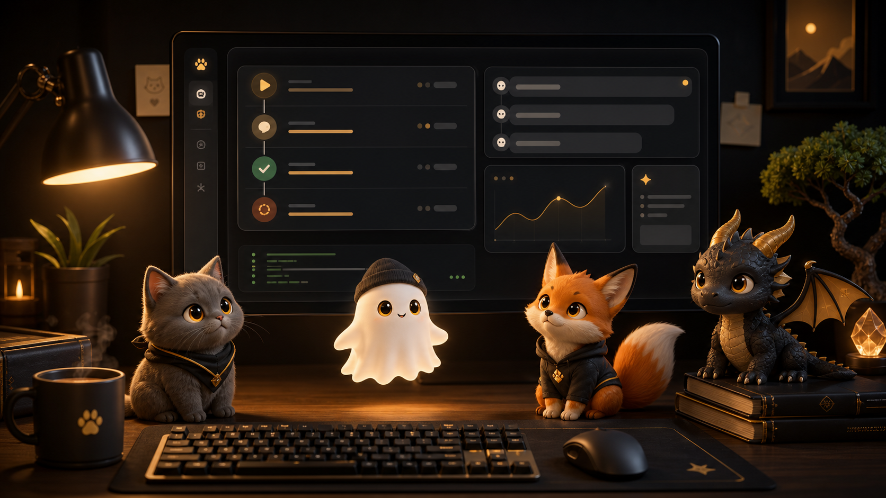

# Hermes Pets



Hermes Pets is a local desktop companion for Hermes-style daily work: a small animated overlay that reacts to commands, messages, briefs, and ambient status events while staying fully controllable from the terminal.

It exists to make long local coding sessions feel more legible and alive. The pet gives visible feedback when work starts, finishes, fails, needs attention, or goes quiet, without requiring a hosted service or remote account.

The repo combines a Python CLI, a WebSocket bridge, local state under `~/.hermes_pet`, and a floating Electron overlay for WSL/Windows. The current tool is focused on practical operator use:

- Launch one floating pet overlay from WSL/Windows.
- Emit lightweight activity events to the overlay.
- Wrap commands so successes, failures, duration, and retry information are recorded.
- Send message notifications from external channels.
- Control quiet/mute preferences for bubbles.
- Generate a short local brief from recent jobs and events.
- Diagnose bridge, overlay, state, prefs, and job-history health.

Pet state and local history live under `~/.hermes_pet` by default. Set `HERMES_PET_HOME` when you intentionally want an isolated state directory.

## Quickstart

Install from the repo, then launch the bridge and overlay:

```bash
# Install from GitHub
pip install 'git+https://github.com/asimons81/hermes-pets.git'

# Or, for local development
cd /home/tony/projects/hermes-pet
pip install -e .

hermes-pet launch
hermes-pet emit bubble "Hello from Hermes Pets"
hermes-pet doctor
```

On WSL/Windows, run the CLI from WSL. `hermes-pet launch` starts the Python bridge in WSL and opens the Electron overlay through the Windows PowerShell launcher.

## Install and CLI

For editable local development:

```bash
cd /home/tony/projects/hermes-pet
pip install -e .
```

With `uv`:

```bash
uv tool install --editable /home/tony/projects/hermes-pet
```

Non-editable installs are also supported:

```bash
cd /home/tony/projects/hermes-pet
pip install .
```

Editable installs use the repo-local `overlay/` directory. Non-editable installs use the packaged overlay assets and copy them to `~/.hermes_pet/cache/overlay` when a real filesystem path is needed for Electron or the Windows PowerShell launcher.

The Python package exposes:

```bash
hermes-pet
hermes-pet-bridge
```

Running `hermes-pet` with no subcommand hatches a pet if one does not exist, or prints the current pet status.

Main commands:

```bash
hermes-pet launch
hermes-pet launch --replace
hermes-pet overlay-status
hermes-pet emit bubble "Starting work"
hermes-pet wrap --name "Tests" -- pytest
hermes-pet jobs --last
hermes-pet brief --since 24h
hermes-pet quiet
hermes-pet mute 30m
hermes-pet doctor
```

Basic pet commands are also available:

```bash
hermes-pet status
hermes-pet hatch
hermes-pet rename "Hermes"
hermes-pet feed
hermes-pet pet
hermes-pet play
hermes-pet species
```

## Custom Animated Pets

Hermes Pets can use custom animated sprite packages without adding generated assets to the repo. Custom pets install into the active state directory:

```text
${HERMES_PET_HOME:-~/.hermes_pet}/custom-pets/<pet-name>/
```

Manage them with:

```bash
hermes-pet custom-pet list
hermes-pet custom-pet validate <path>
hermes-pet custom-pet import <path> --name <name>
hermes-pet custom-pet use <name>
hermes-pet custom-pet current
hermes-pet custom-pet remove <name>
```

`<path>` can be a finalized `hatch-pet` run or a package with `custom-pet.json` and `sprites/<state>/*.png`. `idle` is required; optional states fall back to idle when missing. See `CUSTOM_PETS.md` for the package format and the repo-local Codex skill at `.codex/skills/hermes-pet-hatch/SKILL.md`.

## Launch

Start the bridge and launch the overlay:

```bash
hermes-pet launch
```

On WSL/Windows, `launch` uses `overlay/scripts/launch-windows-overlay.ps1`. That launcher keeps the Electron install in `%LOCALAPPDATA%\HermesAgent\pet-overlay-electron`, reuses an existing overlay when one is already running, and points it at `ws://127.0.0.1:17473` by default.

Replace a stale or duplicate overlay:

```bash
hermes-pet launch --replace
```

Check bridge and overlay process status:

```bash
hermes-pet overlay-status
```

Close the overlay without stopping the bridge:

```bash
hermes-pet close
```

Close the overlay and bridge together:

```bash
hermes-pet close --bridge
```

Useful environment variables:

- `HERMES_PET_HOME`: state directory, default `~/.hermes_pet`.
- `HERMES_PET_PORT`: bridge port, default `17473`.
- `HERMES_PET_HOST`: bridge host, default `127.0.0.1`.
- `HERMES_PET_WS_URL`: explicit overlay bridge URL.
- `HERMES_PET_POSITION_FILE`: overlay window position file.
- `HERMES_PET_SPECIES`: overlay species, default `cat`.
- `HERMES_PET_CLICK_THROUGH=1`: make the overlay ignore mouse input.
- `HERMES_PET_FOCUSABLE=1`: allow the overlay to accept focus.
- `HERMES_PET_DEBUG_EVENTS=1`, `HERMES_PET_DEBUG_ANIMATION=1`, `HERMES_PET_DEBUG_DRAG=1`, `HERMES_PET_DEBUG_SPRITE=1`: diagnostics.

## Emit Events

Emit an ambient event to the live overlay:

```bash
hermes-pet emit bubble "Starting work"
hermes-pet emit status "Tests are running"
hermes-pet emit approval_needed "Review requested"
```

Supported event types:

```text
approval_needed
bubble
daily_brief
job_failed
job_finished
job_history
job_started
message_received
status
```

Events are also appended to local event history under `~/.hermes_pet`.

## Wrap and Run

Wrap named work:

```bash
hermes-pet wrap --name "API tests" -- pytest
```

Run a command with an inferred or optional name:

```bash
hermes-pet run -- npm test
hermes-pet run --name "Docs build" -- npm run build
```

Wrapped commands emit:

- `job_started` before launch.
- `status` during long-running work, every 60 seconds by default.
- `job_finished` for exit code `0`.
- `job_failed` for non-zero exits, launch failures, or interruption.

Disable long-running status events:

```bash
hermes-pet wrap --name "Long job" --status-interval 0 -- ./slow-job
```

Hermes Pets records recent jobs in `~/.hermes_pet/jobs.json`, including start/end time, duration, exit code, status, redacted command, and short output/error summaries when output is captured.

## Jobs and Retry

Show recent jobs:

```bash
hermes-pet jobs
hermes-pet jobs --limit 50
```

Inspect the latest job:

```bash
hermes-pet jobs --last
```

Show failures only:

```bash
hermes-pet jobs --failed
hermes-pet jobs --failed --last
```

Retry the latest safe failed job:

```bash
hermes-pet retry
```

Commands with sensitive-looking arguments such as tokens, passwords, secrets, authorization headers, or API keys are redacted and marked non-retryable.

## Messages

Send a message notification:

```bash
hermes-pet message --source telegram --sender "Ada" "Can you review this?"
```

Mark a message urgent:

```bash
hermes-pet message --source telegram --sender "Ada" --urgent "Production is blocked"
```

Store an open/respond hint without executing it:

```bash
hermes-pet message --source telegram --sender "Ada" --open-command "xdg-open https://example.test" "Thread link"
```

## Quiet, Mute, and Prefs

Important-only quiet mode:

```bash
hermes-pet quiet
```

Silent mode for non-critical bubbles:

```bash
hermes-pet quiet --silent
```

Return to normal:

```bash
hermes-pet quiet --off
```

Mute non-urgent bubbles temporarily:

```bash
hermes-pet mute 30m
hermes-pet mute 2h
```

Inspect or update preferences:

```bash
hermes-pet prefs
hermes-pet prefs set quiet_mode important
hermes-pet prefs set bubble_throttle_seconds 5
hermes-pet prefs set show_idle_bubbles false
```

Preferences live in `~/.hermes_pet/notification-prefs.json`.

## Brief

Summarize recent local jobs and events:

```bash
hermes-pet brief
hermes-pet brief --since 2h
hermes-pet brief --since 7d
```

Emit the brief to the overlay:

```bash
hermes-pet brief --emit
```

Print a compact chat-friendly version:

```bash
hermes-pet brief --telegram-text
```

## Doctor

Run operator diagnostics:

```bash
hermes-pet doctor
```

Doctor checks Python, CLI availability, the `websockets` package, bridge reachability, overlay files, Windows overlay status when available, state directory writeability, preferences, and recent job history.

Warnings do not always mean the tool is unusable. A bridge warning usually means the overlay bridge is not running yet; use `hermes-pet launch` or `hermes-pet launch --replace`.

## Shell Helpers

Optional Bash helpers live in `shell-helpers/hermes-pet.bash`:

```bash
source /home/tony/projects/hermes-pet/shell-helpers/hermes-pet.bash
```

They provide:

- `hp`: `hermes-pet`
- `hpl`: `hermes-pet launch`
- `hps`: `hermes-pet overlay-status`
- `hpjobs`: `hermes-pet jobs`
- `hpfail`: `hermes-pet jobs --failed --last`
- `hpq`: quiet mode helper
- `hpmute`: mute helper, default `30m`
- `hpwrap "Job name" -- command arg...`
- `hpbrief`: brief helper

## Smoke Script

Run the local smoke script:

```bash
scripts/smoke-hermes-pet.sh
```

It checks prefs, runs doctor, emits a bubble, wraps one successful command, wraps one expected failure, prints the latest job, and generates a brief. If the overlay is not running, the emit step may warn while the wrapper and history checks still run.

## Windows and WSL Notes

Hermes Pets is currently tuned for WSL driving a Windows Electron overlay.

- Run CLI commands from WSL.
- Editable installs use the repo-local `overlay/` directory; non-editable installs use the packaged overlay cached under `~/.hermes_pet/cache/overlay`.
- `hermes-pet launch` starts the Python bridge in WSL and launches Electron through PowerShell on Windows.
- `hermes-pet launch --replace` is the recovery path for duplicate or stale overlays.
- The Windows overlay dependencies are cached under `%LOCALAPPDATA%\HermesAgent\pet-overlay-electron`.
- Overlay position is stored in `~/.hermes_pet/overlay-position.json` unless overridden.
- If `emit`, `message`, or `brief --emit` cannot reach the bridge, run `hermes-pet doctor` and then `hermes-pet launch`.

## Important Files

- `src/hermes_pet/cli.py`: command-line interface and operator commands.
- `src/hermes_pet/bridge.py`: WebSocket bridge.
- `src/hermes_pet/custom_pets.py`: custom animated pet package validation, import, and selection.
- `src/hermes_pet/events.py`: local event schema.
- `src/hermes_pet/jobs.py`: wrapped-job history and redaction.
- `src/hermes_pet/prefs.py`: quiet/mute preferences.
- `overlay/src/main.js`: Electron overlay entry point.
- `overlay/src/main.windows.js`: Windows overlay entry point.
- `overlay/src/renderer.js`: overlay behavior and event reactions.
- `overlay/scripts/launch-windows-overlay.ps1`: Windows single-instance launcher.
- `shell-helpers/hermes-pet.bash`: optional shell helpers.
- `scripts/smoke-hermes-pet.sh`: daily smoke test.
- `scripts/validate-custom-pet.py`, `scripts/package-custom-pet.py`: custom pet package helpers.
- `CUSTOM_PETS.md`: custom animated pet format and workflow.
- `OPERATOR_GUIDE.md`: short daily-use guide.

## Recovery

For most daily issues:

```bash
hermes-pet doctor
hermes-pet overlay-status
hermes-pet launch --replace
hermes-pet emit bubble "Sprite check"
```

For history and preference issues:

```bash
hermes-pet prefs
hermes-pet jobs --last
hermes-pet brief --since 24h
```

## License

MIT. See `LICENSE`.
