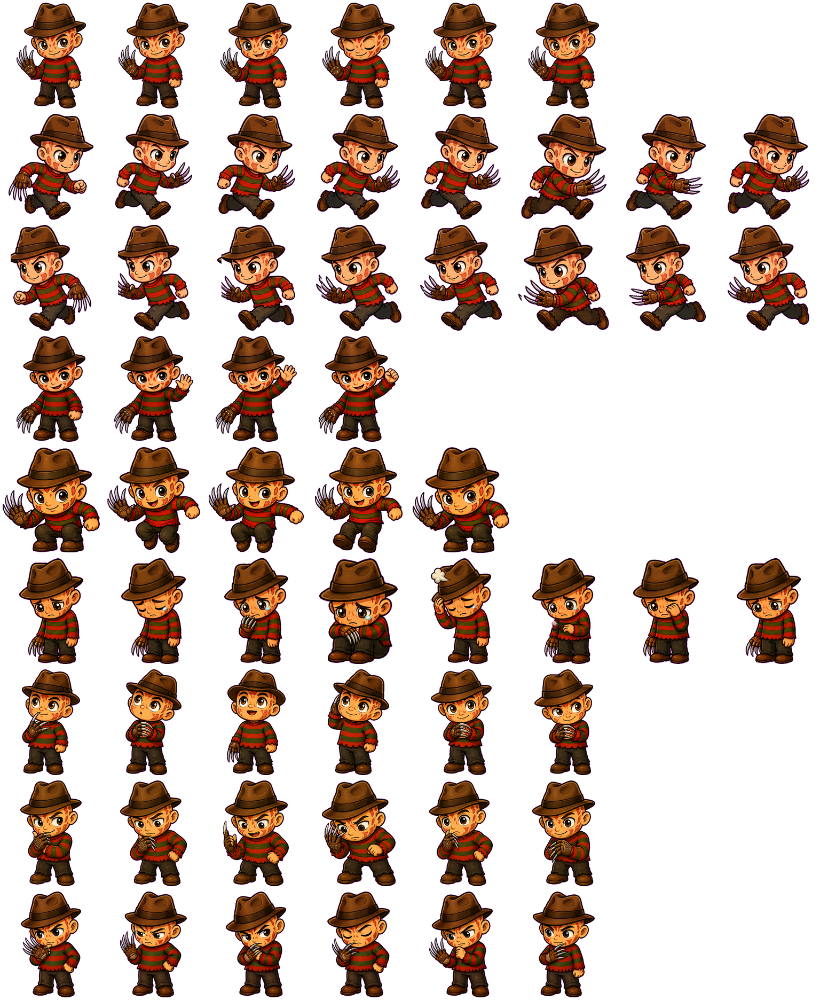
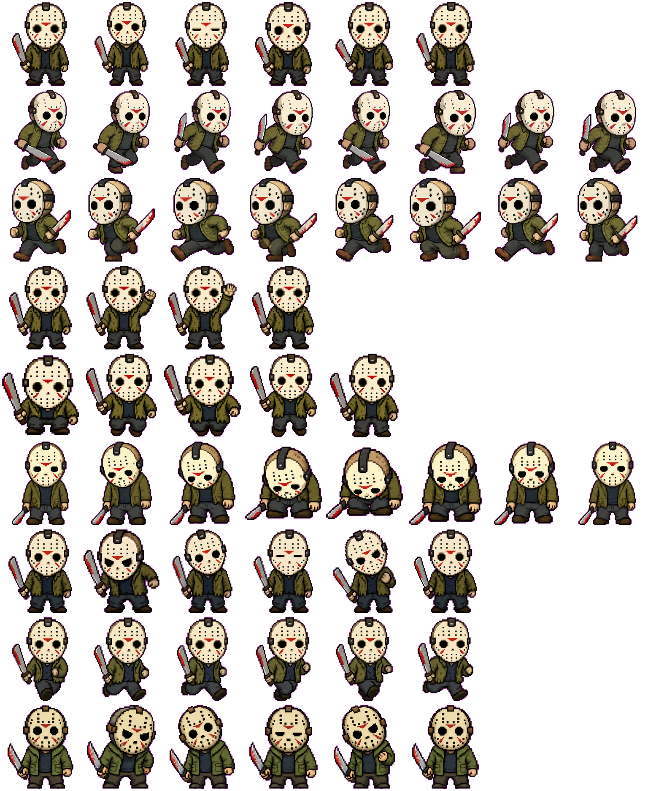
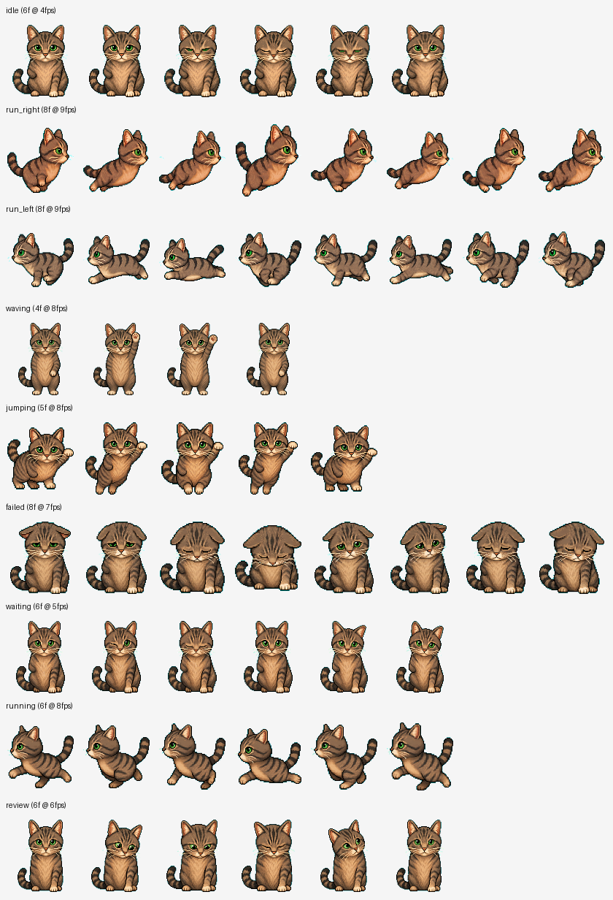

# Curated Custom Pets Gallery

This directory is the open-source gallery for curated custom pets shipped with Hermes Pets.

## Folder tree

```text
docs/custom-pets/
  README.md
  release-checklist.md
  freddy/
    README.md
    custom-pet.json
    sprites/
      idle/
      run_left/
      run_right/
      running/
      waiting/
      failed/
      review/
      jumping/
      waving/
  jason/
    README.md
    custom-pet.json
    sprites/
      idle/
      run_left/
      run_right/
      running/
      waiting/
      failed/
      review/
      jumping/
      waving/
  leatherface/
    README.md
    custom-pet.json
    contact-sheet.png
    sprites/
      idle/
      run_left/
      run_right/
      running/
      waiting/
      failed/
      review/
      jumping/
      waving/
  haskell/
    README.md
    custom-pet.json
    contact-sheet.png
    sprites/
      idle/
      run_left/
      run_right/
      running/
      waiting/
      failed/
      review/
      jumping/
      waving/
```

Each pet folder is a self-contained downloadable package. To add another custom pet later, copy one of the existing folders, keep the package name lowercase, update `custom-pet.json`, write a short README, and validate it before release.

## Preview sheets

These are the real sprite sheets and contact sheets from the curated packages, not mockups.

| Pet | Preview |
| --- | --- |
| Freddy |  |
| Jason |  |
| Leatherface |  |
| Haskell |  |

## Current gallery entries

- Freddy
- Jason
- Leatherface
- Haskell
