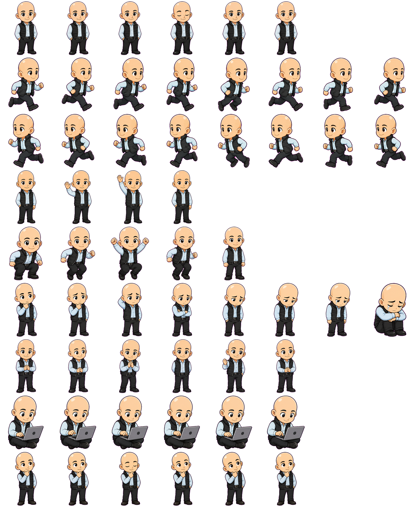

# Jeff Bezos

Jeff Bezos is a curated Hermes Pets custom pet package imported from user-owned Codex pet assets and prepared for repository distribution.

This package is a stylized, public-figure-inspired sprite set. It is not affiliated with, endorsed by, or connected to the person it references.

## Preview



This repo uses the real Codex spritesheet as the preview until we capture a live overlay screenshot.

## Included states

- `failed`
- `idle`
- `jumping`
- `review`
- `run_left`
- `run_right`
- `running`
- `waiting`
- `waving`

## Validation

```bash
hermes-pet custom-pet validate docs/custom-pets/jeff-bezos
hermes-pet custom-pet preview docs/custom-pets/jeff-bezos --output /tmp/jeff-bezos-preview.html
```

## Attribution and license

Submitted by Tony Simons. The sprite package may be redistributed with Hermes Pets under the repository license. The source working files are not included.
