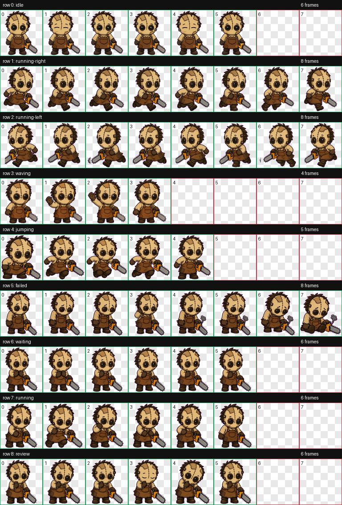

# Leatherface

Leatherface is a curated Hermes Pets custom pet package imported from user-owned Codex pet assets and prepared for repository distribution.

Originally generated in Codex as `leatherbyte`, then renamed to `Leatherface` before publication.

## Preview



The preview above is a real contact sheet from the Codex export, not a mockup.

## Included states

- `failed`
- `idle`
- `jumping`
- `review`
- `run_left`
- `run_right`
- `running`
- `waiting`
- `waving`

## Validation

```bash
hermes-pet custom-pet validate docs/custom-pets/leatherface
hermes-pet custom-pet preview docs/custom-pets/leatherface --output /tmp/leatherface-preview.html
```

## Attribution and license

Submitted by Tony Simons. The sprite package may be redistributed with Hermes Pets under the repository license. The source working files are not included.
